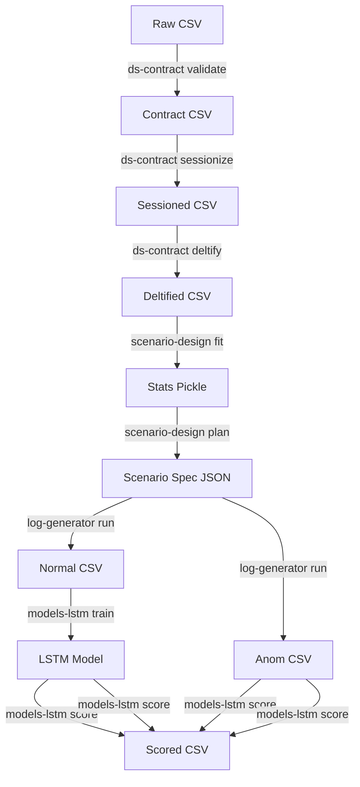

# 使用方法ガイド (USAGE.md)

このドキュメントでは、本リポジトリに含まれる各パッケージの使用方法、コマンドライン引数、および全体的な実行フローについて説明します。

## 目次

1. [全体の流れ (Workflow)](#1-全体の流れ-workflow)
2. [環境構築](#2-環境構築)
3. [各ツールの詳細](#3-各ツールの詳細)
    - [(A) ds_contract](#a-ds_contract)
    - [(B) scenario_design](#b-scenario_design)
    - [(C) log_generator](#c-log_generator)
    - [(D) models_lstm](#d-models_lstm)
    - [(D) models_lstm](#d-models_lstm)
4. [AITログの前処理](#4-aitログの前処理)

---

## 1. 全体の流れ (Workflow)

データ処理パイプラインは以下の順序で実行されます。詳細は `scripts/quickstart.sh` を参照してください。

### Quickstart Script

`scripts/quickstart.sh` は、上記のパイプラインのうち、データ生成から前処理 (`ds-contract`) までを自動化するスクリプトです。

**使用法:**
```bash
./scripts/quickstart.sh [OUTPUT_DIR]
```

- `OUTPUT_DIR` (任意): 出力ディレクトリ。指定しない場合は `artifacts/quickstart` が使用されます。
- 環境変数 `QUICKSTART_SEED` で乱数シードを指定可能です（デフォルト: 202401）。

**例:**
```bash
./scripts/quickstart.sh data/my_experiment
```

### Interactive Pipeline Script

`scripts/interactive_pipeline.py` は、既存のAIT形式ログファイル (`access.log`) と正解ラベル (`labels.csv`) を入力とし、前処理からMATLAB形式へのエクスポートまでを一気通貫で行う対話型スクリプトです。

**使用法:**
```bash
python scripts/interactive_pipeline.py
```
実行すると、以下の項目を対話的に入力するよう求められます。
1. `access.log` のパス
2. `labels.csv` のパス
3. 出力ディレクトリ
4. 乱数シード

このスクリプトは内部で以下のステップを自動実行します:
1. `ds_contract process-ait`: ログの前処理
2. `models_lstm train`: モデル学習
3. `models_lstm score`: データのスコアリング（ラベル列の除外処理含む）




---

## 2. 環境構築

各パッケージをエディタブルモードでインストールすることをお勧めします。

```bash
python -m pip install -e packages/ds_contract -e packages/scenario_design -e packages/log_generator -e packages/models_lstm
```

---

## 3. 各ツールの詳細

### (A) ds_contract

データ契約の検証、セッション化、時間差分($\Delta t$)の計算を行います。

**コマンド:** `python -m ds_contract.cli` または `ds-contract`

#### 共通引数
- `--seed`: 再現性のための乱数シード (必須)

#### サブコマンド: `validate`
生のCSVを契約CSV形式に正規化します。

| 引数 | 必須 | 説明 |
| :--- | :---: | :--- |
| `input_csv` | Yes | 入力となる生のCSVファイルパス |
| `--map` | Yes | カラムマッピングを定義したYAMLファイル |
| `--out` | Yes | 出力先のContract CSVパス |
| `--meta` | No | メタデータ出力先JSONパス (デフォルトは出力と同じ場所) |

**例:**
```bash
ds-contract --seed 42 validate data/raw.csv --map map.yaml --out data/contract.csv
```

#### サブコマンド: `sessionize`
契約CSVからセッションIDを推定・付与し、セッション分割します。

| 引数 | 必須 | 説明 |
| :--- | :---: | :--- |
| `contract_csv` | Yes | `validate` で生成されたContract CSV |
| `--out` | Yes | 出力先のSessioned CSVパス |
| `--meta` | Yes | メタデータ出力先JSONパス |

**例:**
```bash
ds-contract --seed 42 sessionize data/contract.csv --out data/sessioned.csv --meta data/meta_session.json
```

#### サブコマンド: `deltify`
セッション化されたデータから時間差分($\Delta t$)などの特徴量を計算します。

| 引数 | 必須 | 説明 |
| :--- | :---: | :--- |
| `sessioned_csv` | Yes | `sessionize` で生成されたCSV |
| `--out` | Yes | 出力先のDeltified CSVパス |
| `--meta` | Yes | メタデータ出力先JSONパス |

**例:**
```bash
ds-contract --seed 42 deltify data/sessioned.csv --out data/deltified.csv --meta data/meta_dt.json
```

---

### (B) scenario_design

ログの統計情報を学習し、生成シナリオを設計します。

**コマンド:** `python -m scenario_design.cli` または `scenario-design`

#### サブコマンド: `fit`
実データから統計モデル（マルコフ連鎖、タイミング分布など）を学習します。

| 引数 | 必須 | 説明 |
| :--- | :---: | :--- |
| `deltified` | Yes | `ds_contract deltify` の出力CSV |
| `--out` | Yes | 統計情報(.pkl)の出力パス |
| `--seed` | Yes | 乱数シード |

**例:**
```bash
scenario-design fit data/deltified.csv --out data/stats.pkl --seed 42
```

#### サブコマンド: `plan`
学習した統計情報に基づき、正常・異常を含むシナリオ仕様書(JSON)を作成します。

| 引数 | 必須 | 説明 |
| :--- | :---: | :--- |
| `--stats` | Yes | `fit` で出力された統計ファイル(.pkl) |
| `--out` | Yes | シナリオ仕様書(.json)の出力パス |
| `--seed` | Yes | 乱数シード |
| `--anom` | No | 異常注入設定。複数指定可。<br>例: `time(mode=propagate,p=0.02)` |

**例:**
```bash
scenario-design plan --stats data/stats.pkl --out data/spec.json --seed 42 --anom "time(mode=propagate,p=0.02)"
```

---

### (C) log_generator

シナリオ仕様書に基づいて合成ログを生成します。

**コマンド:** `python -m log_generator.cli` または `log-generator`

#### サブコマンド: `run`

| 引数 | 必須 | 説明 |
| :--- | :---: | :--- |
| `--spec` | Yes | `scenario_design plan` で作成した仕様書JSON |
| `--normal` | Yes | 正常ログの出力CSVパス |
| `--anom` | Yes | 異常を含むログ(テスト用)の出力CSVパス |
| `--audit` | Yes | 監査ログ(正解データ)の出力JSONLパス |
| `--meta` | Yes | 実行メタデータの出力JSONパス |
| `--seed` | Yes | 乱数シード |
| `--t0` | No | 開始日時のオーバーライド (ISO形式) |

**例:**
```bash
log-generator run --spec data/spec.json --normal data/normal.csv --anom data/anom.csv --audit data/audit.jsonl --meta data/run_meta.json --seed 42
```

---

### (D) models_lstm

LSTMモデルによる学習と異常検知スコアリングを行います。

**コマンド:** `python -m models_lstm.cli` または `models-lstm`

#### サブコマンド: `train`
正常ログを使用してモデルを学習します。

| 引数 | 必須 | デフォルト | 説明 |
| :--- | :---: | :---: | :--- |
| `--normal` | Yes | - | 学習用Contract CSV (正常) |
| `--val` | Yes | - | 検証用Contract CSV (正常) |
| `--out` | Yes | - | チェックポイント保存ディレクトリ |
| `--seed` | Yes | - | 乱数シード |
| `--batch-size` | No | 256 | バッチサイズ |
| `--epochs` | No | 50 | 最大エポック数 |
| `--learning-rate`| No | 1e-3 | 学習率 |
| その他 | No | | `--embed-dim`, `--hidden-dim`, `--layers`, `--dropout` など |

**例:**
```bash
models-lstm train --normal data/normal.csv --val data/normal.csv --out runs/exp1 --seed 42
```

#### サブコマンド: `score`
学習済みモデルを使用してログに異常スコアを付与します。

| 引数 | 必須 | デフォルト | 説明 |
| :--- | :---: | :---: | :--- |
| `--model` | Yes | - | 学習済みモデルのチェックポイントパス(.ckpt) |
| `--in` | Yes | - | スコアリング対象のCSV (anom.csvなど) |
| `--out` | Yes | - | 結果出力CSVパス (scored.csv) |
| `--seed` | Yes | - | 乱数シード |
| `--weight-cls` | No | 0.5 | 分類誤差の重み |
| `--weight-time` | No | 0.5 | 時間誤差の重み |

**例:**
```bash
models-lstm score --model runs/exp1/best.ckpt --in data/anom.csv --out data/scored.csv --seed 42
```

---


## 4. AITログの前処理

AITログデータセットを処理するための専用コマンドも `ds_contract` に含まれています。

#### コマンド: `ds-contract process-ait`

| 引数 | 必須 | 説明 |
| :--- | :---: | :--- |
| `log_file` | Yes | 入力となるApache Combined Logファイル |
| `label_file` | Yes | 正解ラベルファイル (.log推奨, 内容は `0,0` 形式) |
| `--out` | Yes | 出力ファイルのプレフィックス (例: `data/ait_`) |
| `--seed` | No | (親コマンド引数として指定推奨) |

**出力ファイル例:**
- `{out_prefix}_train_normal.csv`: 正常ログのみ (学習用)
- `{out_prefix}_test_dataset.csv`: 全ログ (評価用、ラベル付き)

**例:**
```bash
ds-contract --seed 42 process-ait raw_logs/access.log raw_logs/labels.csv --out processed/ait
```
